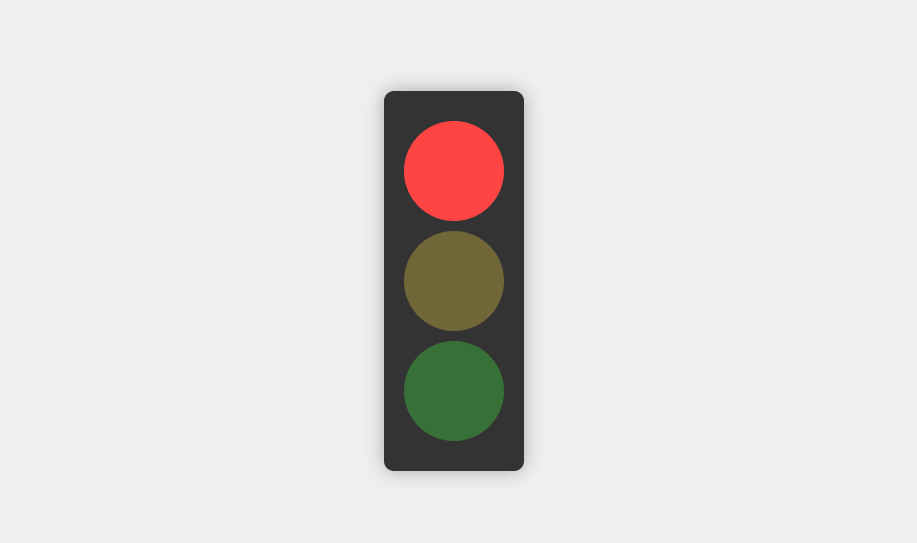

# 🚦 Semáforo Automático Web

Aplicación web que simula el funcionamiento de un semáforo real con cambios automáticos de color cada 5 segundos, desarrollado con tecnologías web básicas (HTML, CSS y JavaScript).

## Características Principales
- ✅ Cambio automático de colores cada 5 segundos
- 🌈 Secuencia luminosa: Rojo → Verde → Amarillo
- 🔄 Ciclo infinito con transiciones suaves
- 📱 Diseño responsive (se adapta a cualquier pantalla)
- 🎨 Efectos visuales realistas con sombras y bordes redondeados
- ⚡ Sin dependencias externas (Vanilla JS)
